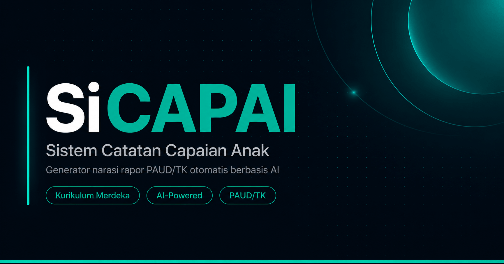

<div align="center">
  

  <br /><br />

  [](https://sicapai.vercel.app)
  [](LICENSE)
  [](https://nodejs.org)

  <p><em>Generator narasi rapor PAUD/TK berbasis AI — hemat waktu, hasil lebih konsisten, dan terasa manusiawi.</em></p>

</div>

---

## Tentang SiCAPAI

Guru PAUD/TK di Indonesia menghabiskan berjam-jam menulis narasi rapor secara manual untuk puluhan siswa — dengan kata-kata yang sering kali berulang dan tidak mencerminkan perkembangan unik setiap anak.

**SiCAPAI** hadir untuk menyelesaikan masalah itu. Guru cukup mencentang capaian perkembangan anak berdasarkan Kurikulum Merdeka, lalu sistem akan menyusun narasi rapor yang kohesif dan personal — dengan bantuan AI sebagai pemoles akhir, bukan pengganti penilaian guru.

> Penilaian tetap milik guru. AI hanya membantu merangkai kata.

---

## Fitur Utama

- **Checklist capaian terstruktur** — 3 elemen intrakurikuler (Agama & Budi Pekerti, Jati Diri, Literasi & STEAM), 4 tingkat capaian (BB / MB / BSH / BSB)
- **Kokurikuler — 8 Dimensi Profil Lulusan** — penilaian karakter & kompetensi lintas mata pelajaran
- **Catatan Istimewa (Nilai Plus)** — rekam keunggulan dan bakat khusus anak
- **Saran Pengembangan** — rekomendasi tindak lanjut untuk orang tua
- **Narasi otomatis dari template** — dihasilkan instan dari pilihan indikator, tanpa AI
- **Poles dengan AI** — satu klik untuk menyempurnakan narasi menjadi lebih mengalir dan natural
- **Indikator ibadah adaptif** — sub-indikator otomatis menyesuaikan agama siswa (Islam, Kristen, Katolik, Hindu, Buddha, Konghucu)
- **Tambah siswa massal** — input tabel interaktif, bisa langsung paste dari Excel/Google Sheets
- **Ekspor rapor** — format `.docx` siap cetak per siswa, atau `.xlsx` rekap seluruh kelas
- **Multi-instansi** — satu akun guru bisa mengelola lebih dari satu sekolah/kelas
- **Quota AI transparan** — guru tahu sisa kuota generasi AI yang tersedia minggu ini

---

## Tech Stack

| Lapisan | Teknologi |
|---|---|
| Frontend | Vanilla JS + Vite (ES Modules, tanpa framework) |
| Backend | Node.js + Express 5 |
| Database | Firestore (Firebase Admin SDK) |
| Auth | Firebase Authentication (Google OAuth) |
| AI | Google Gemini 2.5 Flash |
| Hosting | Vercel (serverless functions + static) — [sicapai.vercel.app](https://sicapai.vercel.app) |
| CI/CD | Vercel Git integration (auto-deploy dari `main`) |

---

## Menjalankan Lokal

### Prasyarat

- Node.js 24+
- Akun Firebase dengan Firestore aktif
- Gemini API key (gratis di [Google AI Studio](https://aistudio.google.com))

### Langkah

```bash
# 1. Clone repositori
git clone https://github.com/mbahnizen/sicapai.git
cd sicapai

# 2. Install dependensi
npm install

# 3. Buat file .env dari contoh
cp .env.example .env
# Edit .env — isi GEMINI_API_KEY, FIREBASE_PROJECT_ID,
# dan semua variabel VITE_FIREBASE_* sesuai konfigurasi Firebase project kamu

# 4. Letakkan service-account.json Firebase di folder server/
#    (Firebase Console → Project Settings → Service Accounts → Generate new private key)

# 5. Jalankan dev server (frontend + backend bersamaan)
npm run dev:all
```

Frontend berjalan di `http://localhost:5173`, backend di `http://localhost:3000`.

---

## Konfigurasi Environment

### Backend (server-side)

| Variabel | Keterangan |
|---|---|
| `GEMINI_API_KEY` | API key Gemini dari Google AI Studio |
| `FIREBASE_PROJECT_ID` | Project ID Firebase |
| `GOOGLE_APPLICATION_CREDENTIALS` | Path ke `service-account.json` (dev lokal) |
| `FIREBASE_SERVICE_ACCOUNT` | Isi JSON service account (produksi). **`project_id` harus `sicapai-paud`** — lihat catatan di bawah |
| `FIREBASE_AUTH_HOSTNAME` | Host tujuan proxy `/__/auth/*`, default `sicapai-paud-a293b.firebaseapp.com` |
| `VITE_FIREBASE_*` | Enam variabel frontend. Di-*bake* Vite **saat build** — mengubahnya wajib diikuti redeploy |
| `PORT` | Port server, default `3000` |
| `NODE_ENV` | `development` atau `production` |

### Frontend (di-bake ke bundle Vite saat build)

| Variabel | Keterangan |
|---|---|
| `VITE_FIREBASE_API_KEY` | Firebase Web API Key |
| `VITE_FIREBASE_AUTH_DOMAIN` | `<project>.firebaseapp.com` |
| `VITE_FIREBASE_PROJECT_ID` | Project ID Firebase |
| `VITE_FIREBASE_STORAGE_BUCKET` | `<project>.firebasestorage.app` |
| `VITE_FIREBASE_APP_ID` | Firebase App ID |
| `VITE_FIREBASE_MESSAGING_SENDER_ID` | Firebase Sender ID |

> **Catatan:** Variabel `VITE_*` bersifat publik — nilainya akan ter-embed ke dalam bundle JavaScript yang dikirim ke browser. Ini adalah perilaku normal untuk konfigurasi Firebase client-side. Pastikan API key sudah dibatasi domain di Google Cloud Console.

---

## Deploy

Aplikasi berjalan di **Vercel**. Push ke `main` memicu deploy otomatis; deploy manual:

```bash
vercel --prod
```

Vercel mem-build dengan `npm run build`, menyajikan `dist/` sebagai statis, dan menjalankan
`api/index.js` (Express yang sama) sebagai serverless function. Routing ada di `vercel.json`.

> ⚠️ **Dua hal yang paling sering menggagalkan deploy.**
>
> 1. **Enam `VITE_FIREBASE_*` di-*bake* saat build.** Menyimpan env var saja tidak cukup — tanpa
>    build baru, bundel lama tetap berisi `undefined` dan aplikasi berhenti di layar loading
>    dengan `auth/invalid-api-key`.
> 2. **Ada dua project Firebase.** `sicapai-paud` adalah produksi; `sicapai-mbahnizen` sudah usang.
>    Kalau `FIREBASE_SERVICE_ACCOUNT` diambil dari project yang salah, login Google tetap berhasil
>    tetapi setiap request API gagal dengan `incorrect "aud" claim`. Penyesatnya: situs hosting
>    `sicapai-paud.web.app` justru berada di dalam project `sicapai-mbahnizen`.

Alur lama berbasis **Cloud Run + GitHub Actions** masih ada di `.github/workflows/deploy.yml`,
tetapi workflow-nya sudah **disabled** dan billing GCP-nya mati. Berkasnya sengaja tidak dihapus
supaya bisa diaktifkan lagi kalau perlu.

---

## Struktur Proyek

```
sicapai/
├── server/                  # Backend Express
│   ├── middleware/          # Auth & Firestore init
│   ├── routes/              # API endpoints (students, reports, AI, dll.)
│   └── services/            # Gemini AI & quota service
├── src/                     # Frontend (Vite)
│   ├── components/          # UI components (app shell, checklist, preview)
│   ├── config/              # Firebase client config
│   ├── data/                # Data kurikulum JSON
│   ├── services/            # API client, template engine, export
│   └── styles/              # CSS global & komponen
├── public/                  # Aset statis (favicon, og-image)
├── .env.example             # Template variabel environment
├── Dockerfile               # Multi-stage build (Vite → Node.js production)
└── vite.config.js
```

---

## Lisensi

[MIT](LICENSE) — bebas digunakan, dimodifikasi, dan didistribusikan.
